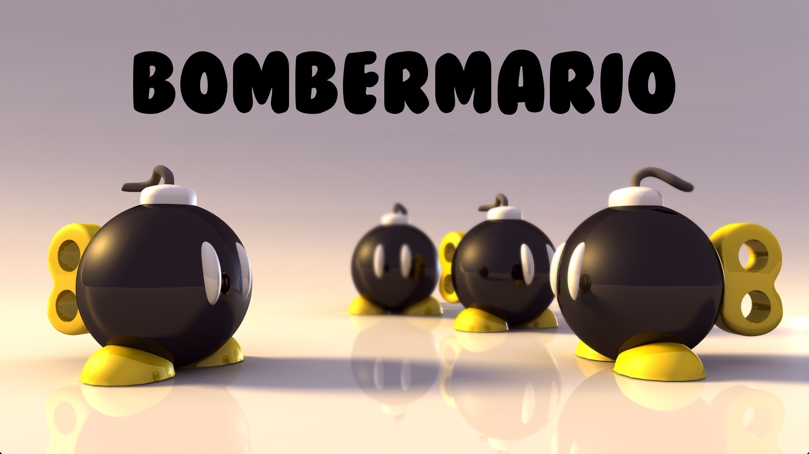
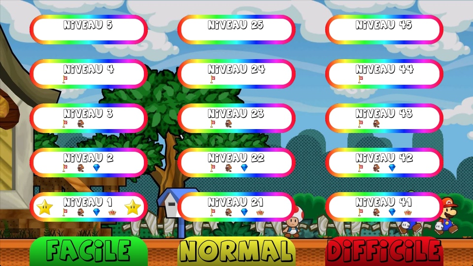
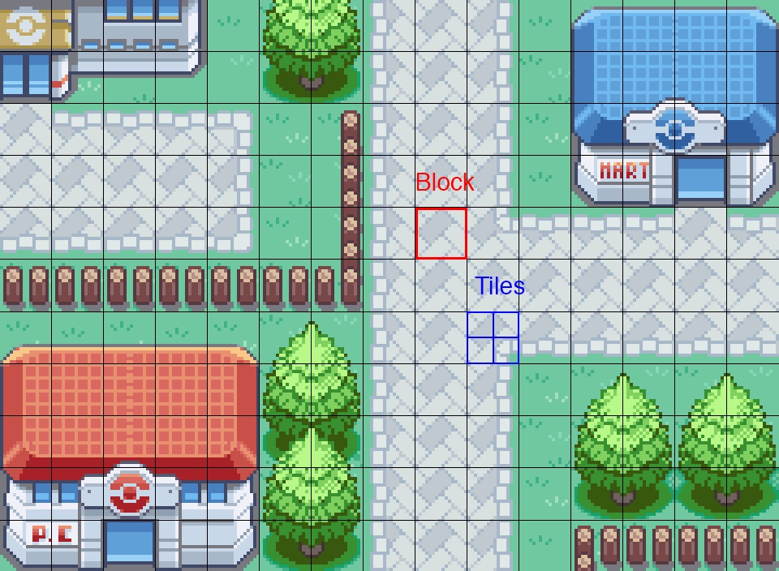
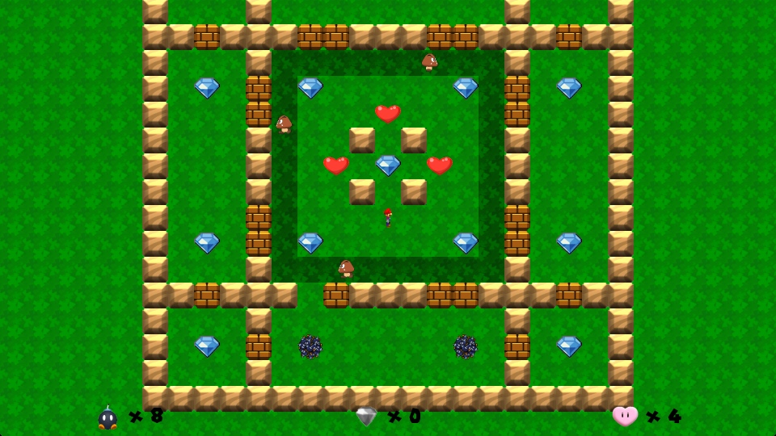

# BomberMario

Lorsque l'on souhaite devenir développeur, le meilleur moyen de progresser est de programmer des jeux connus, tels que le Morpion, le Puissance 4, ou encore les Échecs. Mais il arrive un moment où l'on a fait le tour des principaux jeux, et que l'on voudrait aller au-delà des classiques. Pour moi, BomberMario était l'occasion de créer mon premier véritable jeu-vidéo entièrement fait par mes soins, et qui serait surtout unique au monde. Contrairement à un projet qui existerait déjà, tout était à imaginer pour ce futur chef-d'oeuvre, du nombre de niveaux à la couleur des menus.

Sauf que c'était cela la principale difficulté d'un tel projet : Je ne savais ni par où commencer, ni où aller…

Lorsque je commençais mes précédents projets, je savais à-peu-près ce que je devais faire : Commencer par un personnage qui se déplace, ajouter les ennemis, inclure un menu, et finir par concevoir les niveaux. Mais ici, même le plan de développement n'était pas défini… J'ai donc commencé par programmer le plus important : Un personnage qui se déplace et qui peut poser des bombes. Et j'ai été arrêté par mon premier problème : Comment programmer les bombes et leurs interactions avec le décors ?

Dans le monde du jeu-vidéo 2D, il existe une technique permettant de simplifier le développement des niveaux : Le Tile-Mapping. Le principe est simple : Dans un niveau, ou sur une carte, la plupart des éléments sont identiques et se répètent. Il suffit alors de créer une texture contenant chacun de ces éléments (Appelés "tiles") et de les afficher un par un à l'écran. Ce procédé possède deux avantages : Tout d'abord, il suffit de dessiner les différents tiles une seule fois sur une unique texture, ce qui est beaucoup plus pratique que de dessiner manuellement chacun des niveaux du jeu. Ensuite, il faut attribuer, ou non, des propriétés à chaque tile, comme le fait que le joueur puisse marcher dessus, (Mur) ou si un tile peut être détruit par une bombe. (Brique) Une fois ce principe compris, il me restait à définir mes tiles et à reprendre le développement.

Le système de tiles étant particulièrement performant pour un tel jeu-vidéo, le reste du gameplay a pu être programmé assez facilement.

Enfin, un autre problème qui m'a particulièrement dérangé est la connexion entre BomberMario et son serveur pour le mode multijoueur. Pour synchroniser une partie entre plusieurs joueurs par Internet, il faut faire transiter les informations par un serveur. Chaque fois qu'un joueur se déplace, il va en informer le serveur, qui préviendra à son tour chacun des autres joueurs. C'est ce qui s'appelle une architecture "Client-Serveur".

Sauf qu'une telle architecture dispose de nombreuses contraintes techniques qu'il faut équilibrer. Par exemple, il faut définir une fréquence à laquelle les données seront sauvegardées. Si cette fréquence est trop faible, les déplacements seront saccadés, et la synchronisation ne paraîtra pas naturelle. Mais si elle est trop élevée, le serveur risque de surcharger et de couper toute connexion, si trop de joueurs y sont connectés en même temps. Sans compter qu'il y a plusieurs données à synchroniser, et qu'elles n'ont pas toutes besoin d'être actualisées à la même vitesse… Je devais donc trouver le bon équilibre entre chaque requête, et cela s'est fait au prix de nombreuses heures de test.

Heureusement, le développement a pu se poursuivre et arriver à son terme. Le résultat est un jeu-vidéo à mon image, qu'aucun autre développeur n'avait réalisé avant moi !

Certes, le travail que j'ai finalement dû fournir fut beaucoup plus important que ce que j'avais en tête lorsque j'ai démarré ce projet… Mais il m'aura tout de même apporté deux choses : Tout d'abord, j'ai gagné une solide ligne sur mon CV, celle d'un projet que j'ai développé et managé entièrement par moi-même. Et ensuite, cela m'a permis de comprendre en quoi la préparation d'un projet est importante, et même vitale, pour le mener à son terme.

Si vous désirez en savoir plus, je vous invite à télécharger BomberMario et à le découvrir par vous-même !